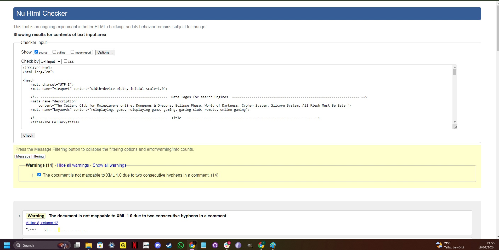
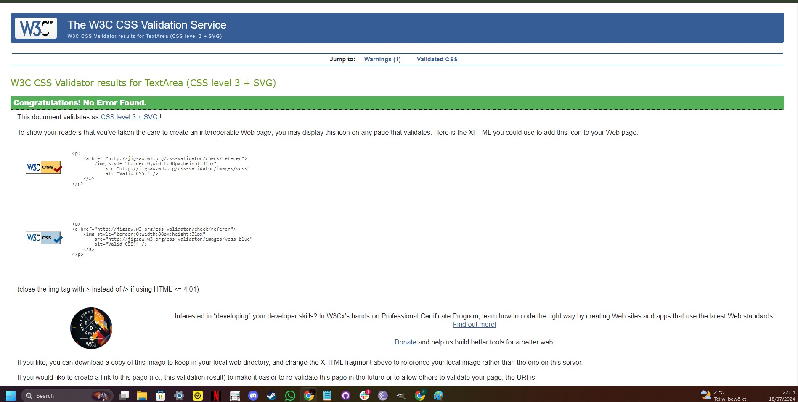

# THE CELLAR

- The Cellar is a basic information page that provides access to a specific Discord group.
- The Cellar is designed to provide access to anyone worldwide an opportunity to join a roleplaying community for online games.
- The Cellar is particularly useful for people that don't have access to a gaming venue.
- The Cellar provides information on the games that are played and about Roleplaying.
- The Cellar provides a selection of links to official site for gaming resources.
- The Cellar offers users the chaance to sign up for more up to date information on current and future games.

## Table of Contents

Click here for Table of Contents

[Mockup Screenshots](#mockup-screenshots)

[UX](#ux)

- [Colour Scheme](#colour-scheme)
- [Typography](#typography)

[User Stories](#user-stories)

- [New site Users](#new-site-users)
- [Returning Site Users](#returning-site-users)

[Wireframes](#wireframes)

- [Mobile Wireframes](#mobile-wireframes)
- [Tablet Wireframes](#tablet-wireframes)
- [Desktop Wireframes](#desktop-wireframes)

[Features](#features)

- [Existing Features](#existing-features)
- [Future Features](#future-features)

[Testing](#testing)

[Deployment](#deployment)

- [Local Deployment](#local-deployment)

- [Local vs Deployment](#local-vs-deployment)

[Credits](#credits)

- [Content and Code](#content-and-code)

- [Media](#media)

- [Acknowledgments](#acknowledgements)

## Mockup Screenshots

 Using the "Am I Responsive" website, here are three examples of the site showig responsivity.

| Index / Main | Join Us | The Games |
| :---: | :---: | :---: |
|  |  |  |

## UX

- The design for The Cellar was created as a series of wireframes sketches covering mobile, tablet and desktop to determine the initial design and layout of the site.
- The Cellar site was designed to provide swift access to the The Cellar Discord Channel and information about current games.
- A bold and colourful layout is designed to provide a sense of fun and community.
- The Cellar expects to see repeated use and to be welcoming to people new to Roleplaying.

### Colour Scheme

- The chosen colour scheme for Your Weather is designed to be inviting and have a neutral aesthetic while giving a nice splash of colour.
- The colours used are as follows:-

- `#forestgreen` used for the primary logo and primary highlights.
- `#yellow`, `#red` and `#blue` used for primary highlights.
- `#blue` and `#ffffff` used for secondary text.
- `#fafafa` and `#brown` used for secondary highlights.
- `#3a3a3a` and `#252525` used for box shadows.
- `#a0a0a0`, `#fff` and `#000` used for border lines.

Click for Coolors screenshot

 

### Typography

- I used the Google Font called 'Chakra Petch' for The Cellar site.
- I felt that this font was both slightly futuristic and easy to read while fitting with the ethos of The Cellar site.

- [Chakra Petch](https://fonts.google.com/specimen/Chakra+Petch) was used for all text within the site.

- [Font Awesome](https://fontawesome.com) icons were used in The Cellaar site, for GitHub links in the footer and the Game On page.

## User Stories

### New Site Users

- As a new site user, I would like to know what the site is about, so that I understand what the site does.
- As a new site user, I would like to learn more about what Roleplaying is.
- As a new site user, I would like to learn what games are usully being played on the Channel.
- As a new site user, I would like to discover more about The Cellar Gaming Community.

### Returning Site Users

- As a returning site user, I would like to be able to access the Discord Channel quickly.
- As a returning site user, I would like to be able to visit the official game websites for additional gaming resources.

## Wireframes

To follow best practice, wireframes were developed for mobile, tablet, and desktop sizes.
I aahve sketched the wireframes on to a board and photographed each page.

### Mobile Wireframes

| Main page | About modal | Displayed weather |
| :---: | :---: | :---: |
|  |  |  |

### Tablet Wireframes

| Main page | About modal | Displayed weather |
| :---: | :---: | :---: |
|  |  |  |

### Desktop Wireframes

| Main page | About modal | Displayed weather |
| :---: | :---: | :---: |
|  |  |  |

## Features

### Existing Features

| Feature | Description | Screenshot |
| :---: | :---: | :---: |
| **Game On!** | The Game On! Page provides a fast link to the Discord Home Page and also provides newcomers with information about how to roleplay. |  |
| **The Games** | The Games page is a list of the current game in play with links to the official websites and brief description of each. |  |
| **Join Us** | The Join Us page is the means by which a user may register to become a Player with the site. |  |
| **Thanks** | The Thanks page is simply a way of saying Thank You and provide new players the opportunity to join a game straight awa with a single click. |  |
| **Footer** | The footer contains a link to various social media groups The Cellar cultivates. |  |

### Future Features

- Database with downloadable resources
  - A feature to provide even faster access to unofficiaal gaming resources.
- Additional games
  - Add more games to the list that are currently advertised
- Game specific pages
  - Additional pages for each of the games to provide even more information.
- Chat Chaannel
  - A feature that allows players to chat whilst not connected to the Discord Channel.

## Tools & Technologies Used

- [HTML](https://en.wikipedia.org/wiki/HTML) used for the main site content.
- [CSS](https://en.wikipedia.org/wiki/CSS) used for the main site design and layout.
- [CSS Flexbox](https://www.w3schools.com/css/css3_flexbox.asp) used for an enhanced responsive layout.
- [Git](https://git-scm.com) used for version control. (`git add`, `git commit`, `git push`)
- [GitHub](https://github.com) used for secure online code storage.
- [GitHub Pages](https://pages.github.com) used for hosting the deployed front-end site.
- [VSCode](https://code.visualstudio.com/) used for local IDE for development.
- [paint](https://www.microsoft.com/en-us/windows/paint) used for editing images, screenshots and favicon.
- [Favicon.cc](https://www.favicon.cc/) used to create the favicon.
- [Google Fonts](https://fonts.google.com/) used to search a suitable font and obtain a download link for that font.
- [Font Awesome](https://fontawesome.com/) used to add GitHub icon to the footer and modal and search icon to the search button.

## Testing

## Code Validation

### HTML

I have used the recommended [HTML W3C Validator](https://validator.w3.org) to validate all of my HTML files.

| Page | Screenshot | Notes |
| :---: | :---: | :---: |
| Index |  | Section lacks header h2-h6 warning and The document is not mappable to XML 1.0 due to two consecutive hyphens in a comment warning. x(16) |
| Game On! |  | The document is not mappable to XML 1.0 due to two consecutive hyphens in a comment warning. |
| The Games |  | The document is not mappable to XML 1.0 due to two consecutive hyphens in a comment warning. |
| Join Us |  | The document is not mappable to XML 1.0 due to two consecutive hyphens in a comment warning. |
| Thanks |  | The document is not mappable to XML 1.0 due to two consecutive hyphens in a comment warning. |

### CSS

I have used the recommended [CSS Jigsaw Validator](assets/documentation/images/w3-org-validation-css.jpg) to validate all of my CSS files.

| File | Screenshot | Notes |
| :---: | :---: | :---: |
| style.css |  | No errors found |

## Deployment

The site was deployed to GitHub Pages. The steps to deploy are as follows:

- In the [GitHub repository](https://github.com/fergus-stonehouse/the-cellar), navigate to the Settings tab.
- From the source section drop-down menu, select the **Main** Branch, then click "Save".
- The page will be automatically refreshed with a detailed ribbon display to indicate the successful deployment.

The live link can be found [here](https://fergus-stonehouse.github.io/the-cellar/).

### Local Deployment

This project can be cloned or forked in order to make a local copy on your own system.

### Local vs Deployment

There are no notable differences between my local developed site and the GitHub pages deployed site.

## Credits

The following are credits to various people and technologies that have directly or otherwise assisted in the creation of the Your Weather site.

### Content and Code

| Source | Location | Notes |
| --- | --- | --- |
| [Chris Beams](https://chris.beams.io/posts/git-commit) | version control | "How to Write a Git Commit Message" |
| [W3Schools](https://www.w3schools.com/howto/howto_css_modals.asp) | Main page | interactive pop-up (modal) for the about section |
| [W3Schools](https://www.w3schools.com/howto/howto_css_switch.asp) | Main page | interactive toggle switch |
| [YouTube](https://www.youtube.com/watch?v=WZNG8UomjSI&t=1783s) | Main page | a source to get an idea of how to lay out the page |
| [Stack Overflow](https://stackoverflow.com/) | Main Page | additional html and css research |
| [Wikimedia](https://en.wikimedia.org/wiki/) | Game On page | Image of Gary Gygax for the image of Games Master |
| [Dungeons & Dragons](https://dnd.wizards.com/) | Main Page | Searching for inspiration |
| [Eclipse Phase](https://eclipsephase.com/) | Main Page | Searching for inspiration |

### Acknowledgements

- I would like to thank my Code Institute mentor, [Chris Quinn](https://github.com/10xOXR) for their support throughout the development of this project.
- I would like to thank [Code Institute](https://codeinstitute.net) for giving me the opportunity to attempt this course.
- I would like to thank the [Code Institute](https://codeinstitute.net) Tutor team for all their guidance.
- I would like to thank the [Code Institute Slack community](https://code-institute-room.slack.com) for the moral support and general information that helps with my studies.
- I would like to thank my family, friends and pets for their support and providing me with feedback for the site.
- I would like to give specialm thanks to my partner who has been an endless source of support.